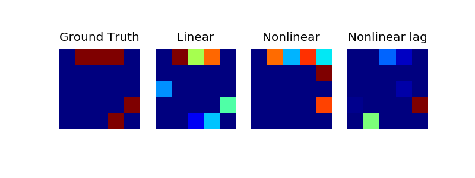

# RNN-GC

## Introduction
This repo contains a python implementation of RNN-GC.  
custom_lstm.py is a re-implementation of LSTM using keras.  
rnn_gc.py is a implementation of NUE strategy

## Requirements: software
* Python 2.7 or 3.6
* Keras
* theano or tensorflow

## Testing Demo
run rnn_gc_demo.py

## Results

## Citing RNN-GC
If you find RNN-GC useful in your research, please consider citing:
Yueming Wang, Kang Lin, Yu Qi, Qi Lian, Shaozhe Feng, Gang Pan, Zhaohui Wu,
 ["Estimating Brain Connectivity with Varying Length Time Lags Using Recurrent Neural Network"](https://ieeexplore.ieee.org/document/8370751), IEEE Transactions on Biomedical Engineering, In press.

